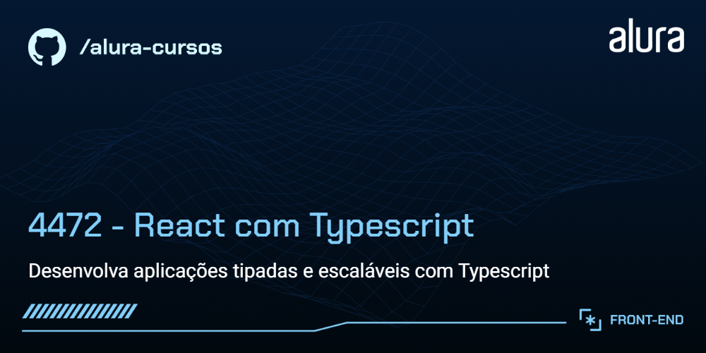

# Luz e Cena

Landing page de um site focado em cinema, que exibe os filmes em cartaz e que ainda vão estrear permitindo selecionar localidade, buscar filmes pelo título, se inscrever para receber informações e muito mais.

## 🔨 Funcionalidades do projeto

A página possui um cabeçalho, um banner, uma lista de filmes, uma seção de newsletter e um rodapé. Os filmes são retornados de uma API's local usando o JSON server. Possui a funcionalidade de filtrar os filmes no campo de busca por título.

  
  

## ✔️ Técnicas e tecnologias utilizadas

As técnicas e tecnologias utilizadas pra isso são:

- `React`: principal biblioteca para construção da interface
- `Typescript`: para adicionar tipagem estática na aplicação
- `Figma`: Protótipo de design da página
- `JSON server`: para simular uma api local
- `classnames`: para lidar com classes CSS e estilização dinâmica
- `react-icons`: biblioteca de ícones do React
- `CSS modules`: para escrever css no React

## 📁 Acesso ao projeto

Você pode [acessar o código fonte do projeto inicial](https://github.com/NeiltonSeguins/4472-react-ts) ou [baixá-lo](https://github.com/NeiltonSeguins/4472-react-ts/archive/refs/heads/aula-01.zip). Se você quiser acessar o figma do projeto, só [clicar neste link](https://www.figma.com/community/file/1464265240934231932).

## 🛠️ Abrir e rodar o projeto

Após baixar o projeto, você pode abri-lo no Visual Studio Code. Para isso, siga os passos abaixo:

1. No menu superior do VS Code, clique em:
   * **File > Open Folder** (ou uma opção similar).
2. Procure o local onde o projeto foi salvo e selecione a pasta (se o projeto foi baixado como um arquivo ZIP, será necessário extraí-lo antes).
3. Clique em **OK**.

## 📚 Mais informações do curso

Gostou do projeto e quer conhecer mais? Você pode [acessar o curso](https://cursos.alura.com.br) que desenvolve o projeto desde o começo!
